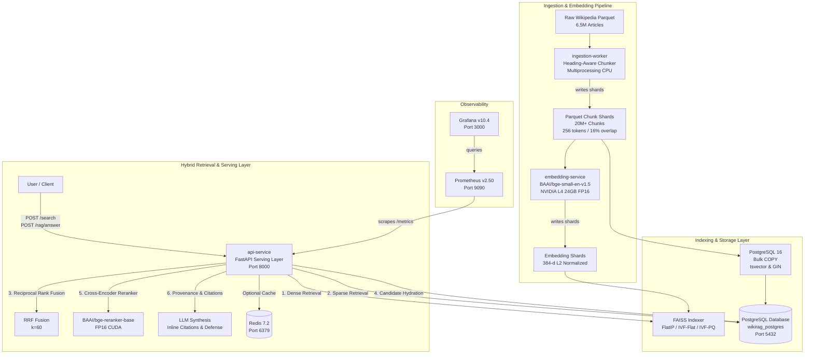

# Parallel Multi-Stage Wikipedia Semantic Search Engine & Grounded RAG

A high-performance, parallel multi-stage semantic search engine and citation-grounded Retrieval-Augmented Generation (RAG) system built over the full English Wikipedia corpus.

---

## 1. Architecture Overview



---

## 2. Hardware Requirements

| Component | Minimum Specification | Recommended Production Setup |
| :--- | :--- | :--- |
| **GPU** | 1x NVIDIA GPU with 16GB VRAM (CUDA 12+) | 2x NVIDIA L4 (24GB VRAM each) |
| **CPU** | 8 cores | 16–128 EPYC cores (tested with up to 128 cores) |
| **Memory (RAM)** | 32 GB | 64–128 GB (with 16GB shared memory `/dev/shm`) |
| **Storage** | 100 GB SSD/NVMe (for pilot / test set) | 1.5 TB+ NVMe RAID partition (e.g. mounted on `/DATA/`) |
| **OS / Runtime** | Linux (Ubuntu 22.04 / Debian 11+) | Linux kernel 5.15+ with NVIDIA Container Toolkit |

---

## 3. Services & Docker Compose Stack

The stack is packaged into modular, production-grade containers orchestrated by Docker Compose:

### Core Services (Started by default)
- **`postgres`** (`postgres:16-bullseye`):
  - Stores article metadata, passage text, and FAISS ID references.
  - Implements high-throughput English full-text search using `tsvector` and `GIN` indexing.
  - Memory-tuned via `postgresql.conf` for large NVMe page caches.
  - Persistent named volume: `postgres_data`.
  - Health check: `pg_isready -U postgres -d wikirag`.

- **`ingestion-worker`** (CPU Daemon / Worker):
  - Multiprocessing heading-aware chunker that streams raw Parquet articles into sentence-preserved passages with deterministic IDs.
  - Checkpointed via `ingestion_checkpoint.json` for crash safety and idempotency.
  - Health check: `python -m src.ingestion.worker --health-check`.

- **`embedding-service`** (GPU Microservice, Port `8001`):
  - Dedicated FastAPI microservice providing vector embeddings via `POST /embed`.
  - Features streaming batch shard embedding (`POST /embed/shards`) with length-bucketed dynamic padding.
  - Dedicated GPU reservation via NVIDIA Container Toolkit.
  - Health check: `curl -f http://localhost:8001/health`.

- **`api-service`** (Serving Layer, Port `8000`):
  - High-concurrency FastAPI service executing 5-stage hybrid retrieval and grounded RAG answer generation.
  - Enforces prompt injection defense (XML-tagged citations, delimiter stripping).
  - Health check: `curl -f http://localhost:8000/health`.

### Optional Services (Activated via Profiles)
- **`redis`** (`redis:7.2-alpine`, Port `6379`):
  - High-speed in-memory cache for repeated queries and embeddings with LRU eviction.
- **`prometheus`** (`prom/prometheus:v2.50.1`, Port `9090`, Profile: `monitoring`):
  - Scrapes operational metrics, stage latencies, and QPS from `api-service:8000/metrics`.
- **`grafana`** (`grafana:10.4.1`, Port `3000`, Profile: `monitoring`):
  - Pre-provisioned dashboards for real-time latency percentiles (p50, p95, p99) and GPU telemetry.

---

## 4. Setup & Deployment Instructions

### Step 1: Clone and Configure Environment

```bash
git clone https://github.com/suraj/distributed-wikipedia-rag.git
cd distributed-wikipedia-rag

# Copy environment template
cp .env.example .env

# (Optional) Edit .env to set your LLM API key, storage paths, or custom passwords
nano .env
```

### Step 2: Ensure Docker Daemon Permissions

Ensure your Linux user belongs to the `docker` group to interact with the Docker daemon without `sudo`:

```bash
sudo usermod -aG docker $USER
newgrp docker

# Verify daemon access
docker ps
```

### Step 3: Run Configuration Verification

Run the automated validation script to check compose syntax, configurations, and prerequisites:

```bash
bash scripts/verify_docker_setup.sh
```

### Step 4: Start Services

#### Start Core Services (Postgres, Ingestion Worker, Embedding Service, API Service, Redis)
```bash
docker compose up -d --build
```

#### Start with Monitoring Dashboards (Prometheus & Grafana)
```bash
docker compose --profile monitoring up -d
```

### Step 5: Verify Health Checks

Check container statuses and readiness:

```bash
docker compose ps

# Test API Service health
curl -s http://localhost:8000/health | jq .

# Test GPU Embedding Service health
curl -s http://localhost:8001/health | jq .

# Check Ingestion Worker logs
docker compose logs --tail=50 -f ingestion-worker
```

---

## 5. Benchmark and Evaluation Commands

All data processing, indexing, benchmarking, and evaluation workflows can be triggered either inside the containers or from the host environment:

### A. Ingestion & Chunking
```bash
# Run one-off ingestion pass over raw files in /data/raw
docker compose run --rm ingestion-worker python -m src.ingestion.worker --single-pass

# Or run chunking benchmark on host
.venv/bin/python scripts/benchmark_chunking.py
```

### B. GPU Embedding Benchmark
```bash
# Benchmark GPU embedding throughput across batch sizes (64, 128, 256, 512)
docker compose run --rm embedding-service python scripts/benchmark_embedding.py --input-dir /data/chunks --output-dir /data/benchmark_embedding
```

### C. FAISS Index Construction & Benchmark
```bash
# Build and evaluate FlatIP, IVF-Flat, and IVF-PQ indexes
docker compose run --rm api-service python scripts/benchmark_faiss.py --embeddings-dir /data/embeddings
```

### D. RAG Evaluation Benchmark (Grounded NQ & TriviaQA)
```bash
# Run controlled 4-mode retrieval evaluation (Dense vs Sparse vs Hybrid vs Reranked)
docker compose run --rm api-service python scripts/evaluate_rag.py --output-dir /data/evaluation
```

### E. Reproducible Ablation Study (6 Dimensions)
```bash
# Run multi-factor ablation (Index type, nprobe, chunk size, retrieval mode, reranking)
docker compose run --rm api-service python scripts/run_ablation.py --dimensions all --output-dir /data/ablation
```

---

## 6. API Usage Examples

### 1. Hybrid Semantic Search (`POST /search`)
```bash
curl -X POST http://localhost:8000/search \
  -H "Content-Type: application/json" \
  -d '{
    "query": "What instrument does Brad Mehldau play?",
    "top_k": 5,
    "use_reranker": true
  }' | jq .
```

### 2. Grounded RAG Question Answering (`POST /rag/answer`)
```bash
curl -X POST http://localhost:8000/rag/answer \
  -H "Content-Type: application/json" \
  -d '{
    "question": "What position did Vassilios Skouris hold in the European Union?",
    "top_k": 5,
    "temperature": 0.2
  }' | jq .
```

### 3. Direct Vector Embedding Microservice (`POST /embed`)
```bash
curl -X POST http://localhost:8001/embed \
  -H "Content-Type: application/json" \
  -d '{
    "texts": ["Superconducting quantum processors operate near absolute zero."]
  }' | jq .
```

---
5. **No Hardcoded Secrets**:
   - Never commit `.env` with production keys to source control. Use environment variable injection in CI/CD or secrets managers (e.g. HashiCorp Vault, AWS Secrets Manager).

